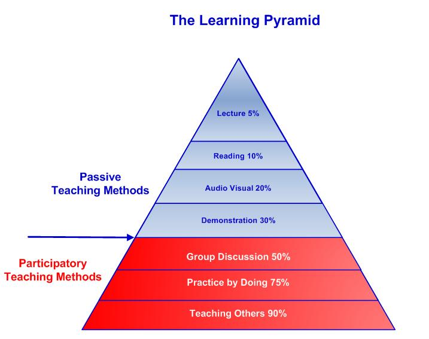

## Context

## Learned in this study
* Information is not the same as data. The same information can be expressed (coded) using more or less data

## Things to explore
* Which channel has the best retention rate?
* What is the rate of image creation within the mind?

# Overview

# Output
* Handwriting: 30 wpm [^5]
* Sign: About half the rate of speech, thus 50-62 wpm [^6]
* Typing: 50-80 wpm [^5] [^4]
* Speech: 100-125 wpm for slide presentations, 150-160 wpm for audiobooks [^5]

# Input
* Listening: 100-125 wpm for slide presentations, 150-160 wpm for audiobooks [^5]
* Reading: 228±30 wpm (in English) [^5]

# Space requirements
| Medium | Per minute | Per day | Per year | Description |
|--------|------------|---------|----------|-------------|
| Text | 1 KB | 1.5 MB | 512 MB | At the same rate the average human can read, 230 words per minute or around 1000 characters per minute |
| Audio (voice only) | 60-480 KB | 84-675 MB | 30-241 GB | 300-3400 Hz, 8-64 kbps |
| Audio (audible) | 1-3 MB | 1-4 GB | 505-1261 GB | 20-20000 Hz, up to 40 kHz, 128-320 kbps  |
| Video | 23-45 MB | 32-65 GB | 12-24 TB | 1080p@30fps, 3-6 Mbps |
| Taste | ? | ? | ? | - |
| Smell | ? | ? | ? | - |
| Heat | ? | ? | ? | - |
| Pressure | ? | ? | ? | - |

# Retention
> You remember approximately 30 percent of what you see.
> You remember approximately 50 percent of what you hear and see together.
> You remember approximately 70 percent of what you say (if you think as you are saying it).
> You remember approximately 90 percent of what you do.[^1]

Source: Darthmouth College

> We retain approximately 10 percent of what we see;
> 30 to 40 percent of what we see and hear;
> and 90 percent of what we see, hear, and do.
> We all have the capability to learn via all three styles, but are usually dominate in one. [^2]

Source: National Highway Institute

 [^3]

# See also
* [Senses](../senses)

# References
[^1]: http://www.dartmouth.edu/~acskills/docs/study_actively.doc
[^2]: https://www.nhi.fhwa.dot.gov/downloads/freebies/172/PR%20Pre-course%20Reading%20Assignment.pdf
[^3]: http://thepeakperformancecenter.com/educational-learning/learning/principles-of-learning/learning-pyramid/
[^4]: http://typefastnow.com/average-typing-speed
[^5]: https://en.wikipedia.org/wiki/Words_per_minute
[^6]: http://lcn.salk.edu/publications/SOL/SOL%20-%208%20Rate%20of%20Speech%20and%20Sign.pdf

* https://en.wikipedia.org/wiki/Forgetting_curve
